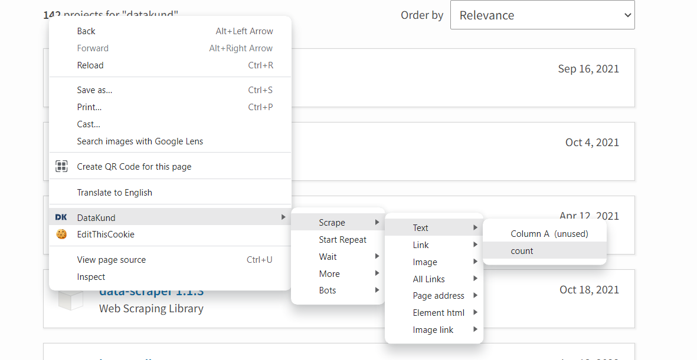

**************
API Tutorials
**************

Basic Introduction
*******************

There are two parts of DataKund:-

DK Extension:-
##############

DK Extension is the user interface through which user can iteract with tool.
These are things which you can do through Extension:-

1. Can create,run, customize apis

2. It records your actions

3. You can access code to apis

4. Can publish these apis

5. And many more, discussed in detail in further sections.

Automated Browser:-
###################

This is the main part of your apis, where your apis will run.
For Example, if you made an api of login to instagram, then that api will do login in this browser.

Record
###############
Record basically refers to the actions recorded in api. These actions will be done when bot is run. When recording, the actions are shown in charts of Extension window as shown below

  
  
Run
###############
You can now run your api by filling inputs accordingly.

  
Code
#####
DataKund provides packages for python and nodejs. The code for these apis can be found inside Code tab.
You can copy the code and run directly in your framework.

.. warning::
	If you want to call your apis in your code, then consider api names which do not contain space, special character etc.

How to open url using DataKund?
********************************

Open Static Url
###############

To open a static URL, training is very simple. Just click on the Train button and open the URL which needs to be opened. Then go back and Run api.

.. image:: images/static_url.png
  :width: 400
  :alt: Alternative text

Open Dynamic Url
#################

To open a dynamic URL , follow these steps:-

1. Create a new bot. Click on Record and then click on Variables.

.. image:: images/dynamic_url.png
  :width: 400
  :alt: Alternative text

2. Click on Add Input Button and add new variable "link" as shown below

.. image:: images/dynamic_url2.png
  :width: 400
  :alt: Alternative text

3. Now go back to record and then Right click>DataKund>Inputs>Variables>link>Open Link.

4. Now go back and run bot.

How to perform click action using DataKund?
*******************************************

1. Open url https://www.amazon.com/ and then we can see the charts by clicking on extension icon as shown below. As we opened a url so url event is shown in chart

2. Now Click on Kindle eBooks. We can see click event added in charts.

3. Go back and Run api.

How to scrape text using DataKund?
*******************************************

1. Make a new api and click on Record.

2. Open https://pypistats.org/packages/bot-studio in browser.

3. Now click on inputs/columns as shown below

.. image:: images/scrape_text1.png
  :width: 400
  :alt: Alternative text
  
4. Add a column named ``count`` and click on save.

.. image:: images/scrape_text2.png
  :width: 400
  :alt: Alternative text
  
5. Now Right Click on count "142"> DataKund>Scrape>Text>count

  
6. Go back and Run api.